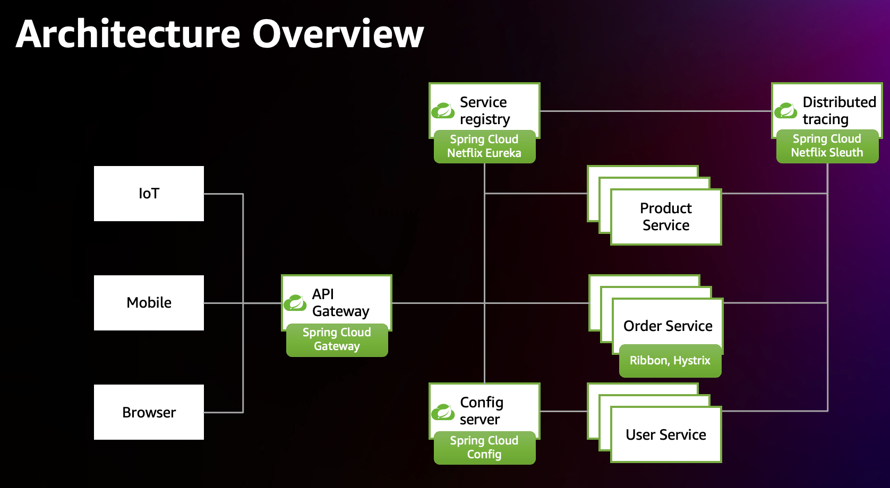
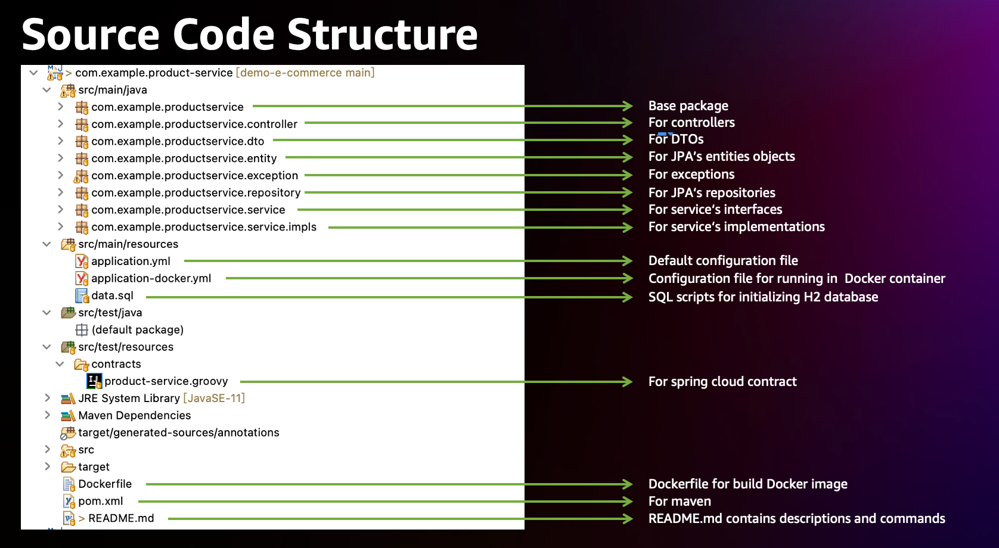

# Homework: e-commerce-by-spring-cloud

## According to the requirements:

### 1. Architecture of the application:

### 2. Source code structure of each micro service:

### 3. Spring Cloud Features to Implement:
1. Service Registration and Discovery: Use Eureka for service registration and discovery.
    * Use spring cloud netflix eureka server to implement this feature, all the codes are in folder eureka-server.

* Spring Cloud Gateway Integration: Implement Spring Cloud Gateway for routing requests to microservices.
    * Use spring cloud gateway to implement this feature, all the codes are in folder gateway-service.

* Load Balancing: Utilize Ribbon for client-side load balancing.
    * Use spring cloud openfeign to implement this feature in method " com.example.orderservice.service.impls.OrderServiceImpl.createOrder" which belongs to order service.
    * When create an order, OrderServiceImpl will first invoke product service to check if there have enough stock, use feign client, with ribbon integrated, to finish the invocation.
    * After create an order, OrderServiceImpl will invoke product service to decrease stock, this is also done by feign client and ribbon.

* Distributed Configuration: Implement centralized configuration management using Spring Cloud Config Server.
    * Use spring cloud config to implement this feature, all the codes are in folder config-server.

* Circuit Breaker: Implement resilience using Hystrix for circuit breaking.
    * Use spring cloud netflix hystrix to implement this feature in method " com.example.orderservice.service.impls.OrderServiceImpl.createOrder" which belongs to order service.
    * When create an order, OrderServiceImpl will first invoke product service to check if there have enough stock, when request timeout, hystrix will do the circuit breaking and use the fallbackMethod "handleStockCheckFailure".
    * "com.example.productservice.controller.StockController.getStockByProductId" leverage "System.currentTimeMillis() % 2" to generate random thread sleeping to mock timeouts, so this can trigger the circuit breaking.
    
* Logging and Monitoring: Integrate your application with Spring Cloud Sleuth and Zipkin for distributed tracing. 
    * Use docker image to run an instance of zipkin-server to implement this feature.
    * Config zipkin and sleuth in application.yml.

* Product Service is implement in the product-service folder.

* Order Service is implement in the order-service folder.

* User Service is implement in the user-service folder.

* Unit tests are in src/test/java.

* Database Integration: Use H2 in-memory database for storing product, order, and user data.

### 4. Build docker image and run services.
1. create network
    `docker network create e-commerce-for-spring-cloud-network`

2. eureka-server
    * enter to eureka-server directory: 
    `cd eureka-server`
    * Build docker image: 
    `docker build -t eureka-server .`
    * Run as container: 
    `docker run --name eureka-server --network e-commerce-for-spring-cloud-network -p 8761:8761 eureka-server:latest`

3. gateway-service
    * enter to gateway-service directory: 
    `cd gateway-service`
    * Build docker image: 
    `docker build -t gateway-service .`
    * Run as container: 
    `docker run --name gateway-service --network e-commerce-for-spring-cloud-network -p 8080:8080 -e EUREKA_SERVER=http://eureka-server:8761/eureka gateway-service:latest`

4. config-server
    * enter to config-server directory: 
    `cd config-server`
    * Build docker image: 
    `docker build -t config-server .`
    * Run as container: 
    `docker run --name config-server --network e-commerce-for-spring-cloud-network -p 8888:8888 -e EUREKA_SERVER=http://eureka-server:8761/eureka config-server:latest`

5. zipkin-server
    * Run zipkin-server directly: 
    `docker run --name zipkin-server --network e-commerce-for-spring-cloud-network -p 9411:9411 openzipkin/zipkin:latest`

6. product-service
    * enter to product-service directory: 
    `cd product-servicer`
    * Build docker image: 
    `docker build -t product-service .`
    * Run first container at 8081: 
    `docker run --name product-service --network e-commerce-for-spring-cloud-network -p 8081:8081 -e CONFIG_SERVER=http://config-server:8888 -e EUREKA_SERVER=http://eureka-server:8761/eureka -e ZIPKIN_SERVER=http://zipkin-server:9411 product-service:latest`
    * Run second container at 8181: 
    `docker run --name product-service-8181 --network e-commerce-for-spring-cloud-network -p 8181:8081 -e CONFIG_SERVER=http://config-server:8888 -e EUREKA_SERVER=http://eureka-server:8761/eureka -e ZIPKIN_SERVER=http://zipkin-server:9411 product-service:latest`

7. order-service
    * enter to order-service directory: 
    `cd order-service`
    * Build docker image: 
    `docker build -t order-service .`
    * Run as container: 
    `docker run --name order-service --network e-commerce-for-spring-cloud-network -p 8082:8082 -e CONFIG_SERVER=http://config-server:8888 -e EUREKA_SERVER=http://eureka-server:8761/eureka -e ZIPKIN_SERVER=http://zipkin-server:9411 order-service:latest`

8. user-service
    * enter to user-service directory: 
    `cd user-service`
    * Build docker image: 
    `docker build -t user-service .`
    * Run as container: 
    `docker run --name user-service --network e-commerce-for-spring-cloud-network -p 8083:8083 -e CONFIG_SERVER=http://config-server:8888 -e EUREKA_SERVER=http://eureka-server:8761/eureka -e ZIPKIN_SERVER=http://zipkin-server:9411 user-service:latest`

### 5. Visit urls and apis.
1. eureka-server: [http://localhost:8761/](http://localhost:8761/ "http://localhost:8761/")
2. gateway-service: [http://localhost:8080/actuator/](http://localhost:8080/actuator/ "http://localhost:8080/actuator/")
3. config-server: [http://localhost:8888/actuator/](http://localhost:8888/actuator/ "http://localhost:8888/actuator/")
4. zipkin-server: [http://localhost:9411/zipkin/](http://localhost:9411/zipkin/ "http://localhost:9411/zipkin/")
5. product-service:
    * show single product: [http://localhost:8081/api/products/1](http://localhost:8081/api/products/1 "http://localhost:8081/api/products/1")
    * show all products: [http://localhost:8081/api/products](http://localhost:8081/api/products "http://localhost:8081/api/products")
    * other apis: [http://localhost:8081/actuator/mappings](http://localhost:8081/actuator/mappings "http://localhost:8081/actuator/mappings")
6. order-service:
    * show single order: [http://localhost:8082/api/orders/1](http://localhost:8082/api/orders/1 "http://localhost:8082/api/orders/1")
    * show all orders: [http://localhost:8082/api/orders](http://localhost:8082/api/orders "http://localhost:8082/api/orders")
    * other apis: [http://localhost:8082/actuator/mappings](http://localhost:8082/actuator/mappings "http://localhost:8082/actuator/mappings")
7. user-service (password just shown for debug):
    * show single user: [http://localhost:8083/api/users/1](http://localhost:8083/api/users/1 "http://localhost:8083/api/users/1") 
    * show all users: [http://localhost:8083/api/users](http://localhost:8083/api/users "http://localhost:8083/api/users") 
    * other apis: [http://localhost:8083/actuator/mappings](http://localhost:8083/actuator/mappings "http://localhost:8083/actuator/mappings") 

### 6. Use curl command to create orders and verify whether hystrix circuit breaking works.
1. Use curl send POST request to create order: `curl -X POST http://localhost:8082/api/orders -H 'Content-Type: application/json' -d '{"userId": 1,"productId": 2,"quantity": 100}'`
2. If order created successfully, the server will response json like: `{"id":5,"userId":1,"productId":2,"quantity":100,"status":"CREATED"}` , the value of field status will be "CREATED". 
3. If timeout, the server will response json like: `{"id":null,"userId":1,"productId":null,"quantity":100,"status":"Timeout by Hystrix"}` , the value of field  status will be "Timeout by Hystrix". 
4. If there is not enough stock, the server will response json like: `{"id":null,"userId":1,"productId":null,"quantity":100,"status":"Insufficient Stock"}` , the value of field  status will be "Insufficient Stock". 

